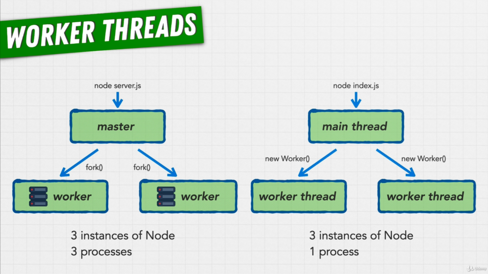

# worker-threads-example

Node.js Worker Threads Example

Image from [Complete NodeJS Developer in 2022 (GraphQL, MongoDB, + more)](https://www.udemy.com/course/complete-nodejs-developer-zero-to-mastery/) Course Created by [Andrei Neagoie](https://www.udemy.com/user/andrei-neagoie/) and [Adam Odziemkowski](https://www.udemy.com/user/adam-odziemkowski/)
